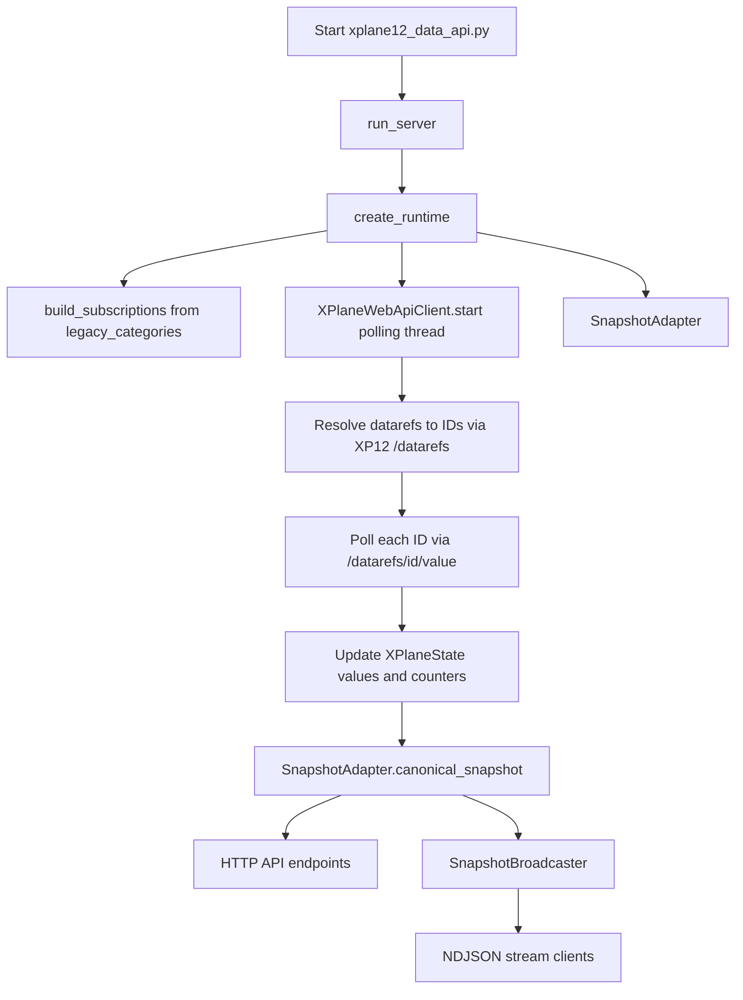
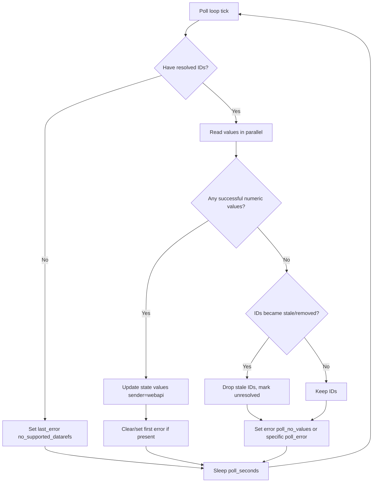
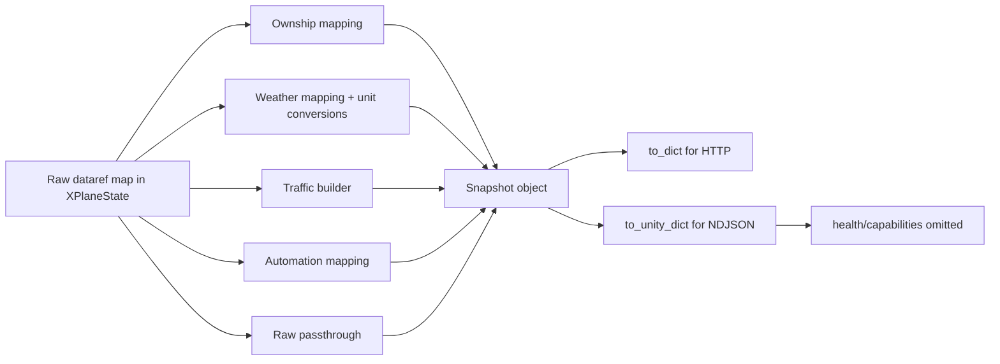

# xplane12

Standalone X-Plane 12 host/runtime repository. The Python package lives under `xplane12/` at the repo root.

## Layout

- `xplane12/host/xplane12_web_autoflight.py` — waits for the XP12 Web API, optionally air-starts once, then runs the endless-flight relay.
- `xplane12/host/xplane_remote_relay.py` — telemetry relay for `mock`, `xpc`, `rref`, and `auto` modes. Current production host usage is pinned to `rref`.
- `xplane12/host/xplane12_data_api.py` — local snapshot/stream API.
- `xplane12/host/bin/` — remote wrapper scripts copied to the target host home directory.
- `xplane12/host/systemd/` — example systemd units for Linux host deployment.
- `xplane12/host/tools/` — local install/restart/diag/log helpers.
- `xplane12/host/env/xplane12.env.example` — example host environment file.
- `xplane12/host/tests/` — Python tests for the XP12 host modules.

## What starts what

On the remote host, the deployment examples assume wrapper scripts live in the target user's home directory. Adapt the username/home path as needed for your host:

- `/home/your-user/xplane12_launch.sh`
  - launches or reuses the real X-Plane 12 process.
- `/home/your-user/xplane12_autoflight.sh`
  - runs `xplane12/host/xplane12_web_autoflight.py` from the deployed repo checkout.
- `/home/your-user/xplane12_data_api.sh`
  - runs `xplane12/host/xplane12_data_api.py` from the deployed repo checkout.
- `/home/your-user/xplane12_api_tunnel.sh`
  - opens the reverse SSH API tunnel.
- `/home/your-user/tunnel_xplane_49013.sh`
  - opens the TCP/UDP bridge and reverse tunnel for port 49013.

The systemd units in `xplane12/host/systemd/` call those wrappers. They are example units and should be edited to match your actual username/home path before installation.

## Canonical local commands

### 1. Configure the host env file

Start from the example file and adapt it for your host:

```bash
cp xplane12/host/env/xplane12.env.example /home/your-user/xplane12.env
```

Important settings:

- The example systemd units and wrapper scripts use `/home/your-user` placeholders. Replace `your-user` with the account that owns the deployment on your host.

- `XPLANE_HOME`
- `XPLANE_BIN`
- `XPLANE_ARGS`
- `DISPLAY`
- `XAUTHORITY`
- `XDG_RUNTIME_DIR`
- `DBUS_SESSION_BUS_ADDRESS`
- `API_BASE_URL`
- `RELAY_MODE` (production default is `rref`)
- tunnel settings such as `TUNNEL_REMOTE_HOST`

### 2. Install/update everything on the target host

```bash
bash xplane12/host/tools/install_xplane12_4090_host.sh user@your-host
```

What this does:

- copies wrapper scripts to the target host home directory
- copies service files to the target host home directory and installs them into `/etc/systemd/system/`
- copies the `xplane12` Python tree to `${REMOTE_HOME}/Development/xplane12` by default
- enables and starts all host services
- runs the remote diagnostic script by default

If you want install without the final diagnostic pass:

```bash
bash xplane12/host/tools/install_xplane12_4090_host.sh --no-diag user@your-host
```

### 3. Start or restart the full X-Plane 12 autopilot/runtime stack

Use the convenience wrapper:

```bash
bash xplane12/host/tools/start_xplane12_autopilot.sh user@your-host
```

This currently delegates to the installer so the host gets the latest wrappers/code and then restarts the full service stack.

Equivalent direct command:

```bash
bash xplane12/host/tools/install_xplane12_4090_host.sh user@your-host
```

If the host is already up to date and you only want a service restart:

```bash
bash xplane12/host/tools/restart_xplane12_4090_host.sh user@your-host
```

### 4. Run diagnostics

```bash
bash xplane12/host/tools/run_xplane12_4090_diag.sh user@your-host
```

You can also pass through extra diag arguments, for example:

```bash
bash xplane12/host/tools/run_xplane12_4090_diag.sh user@your-host --logs 150 xplane12-autoflight.service
```

### 5. Check service logs

```bash
bash xplane12/host/tools/logs_xplane12_4090_host.sh user@your-host xplane12-autoflight.service --lines 200
```

Follow logs live:

```bash
bash xplane12/host/tools/logs_xplane12_4090_host.sh user@your-host xplane12-autoflight.service --follow --lines 200
```

## Expected healthy runtime

After install/restart, these services should be active:

- `xplane12-simulator.service`
- `xplane12-autoflight.service`
- `xplane12-data-api.service`
- `xplane12-tunnel.service`
- `xplane-49013-tunnel.service`

Expected healthy checks:

```bash
curl http://127.0.0.1:12678/health
curl http://127.0.0.1:12678/v1/snapshot
curl http://127.0.0.1:8086/api/v3/datarefs/count
```

The relay stream should be reachable on `127.0.0.1:37211` and, for current production host usage, should emit `"source_mode":"rref"`.

## API usage

The local XP12 data API is served by `xplane12/host/xplane12_data_api.py` and, on the host, normally listens on:

- HTTP: `127.0.0.1:12678`
- NDJSON stream: `127.0.0.1:37212`

Run it manually if needed:

```bash
python3 xplane12/host/xplane12_data_api.py \
  --bind-host 127.0.0.1 \
  --bind-port 12678 \
  --stream-host 127.0.0.1 \
  --stream-port 37212 \
  --xp-base-url http://127.0.0.1:8086/api/v3
```

### How XP12 data are extracted (detailed flow)

The extraction path is implemented by these modules:

- `xplane12/compat/legacy_categories.py` defines the full dataref subscription set (`aircraft`, `weather`, `systems`, `traffic`).
- `xplane12/bridge/webapi_client.py` resolves dataref IDs from the XP12 Web API and continuously polls their values.
- `SnapshotAdapter` (same file) transforms raw values into the canonical `Snapshot` model (`ownship`, `weather`, `traffic`, `automation`, `raw`, `health`, `capabilities`).
- `xplane12/api/server.py` serves snapshots over HTTP and broadcasts Unity-facing NDJSON snapshots.

At runtime, extraction is pull-based from the X-Plane Web API (`/api/v3`), not push-based from UDP:

1. Build subscription list from static category definitions.
2. Resolve each dataref name to an XP12 numeric ID via `GET /datarefs?...filter[name]=...`.
3. Poll each resolved ID via `GET /datarefs/{id}/value`.
4. Coerce values to numeric floats and update in-memory bridge state.
5. Build canonical snapshot from the latest values.
6. Serve the snapshot through HTTP endpoints and NDJSON stream.

#### Flow chart: end-to-end extraction and serving



#### Flow chart: polling/error behavior



#### Flow chart: snapshot transformation



#### Extraction details by stage

- **Subscription stage**
  - Categories and datarefs are declared statically in `legacy_categories.py`.
  - Traffic expansion includes multiplayer planes (`plane1..plane19`) and TCAS slots (`0..7`).
  - Each subscription is assigned a stable local index (starting at `2000`) for introspection via `/datarefs`.

- **Resolution stage**
  - For every unique dataref string, the client calls `/datarefs` with a name filter.
  - Successful matches are cached in `resolved_ids`; misses go to `unresolved_datarefs`.
  - If all lookups fail, runtime health reports `no_supported_datarefs`.

- **Polling stage**
  - Values are polled concurrently with a thread pool.
  - Scalars, bools, and single-item arrays are coerced to float.
  - 404 on value lookup marks dataref stale and forces re-resolution later.
  - Packet and pair counters are updated only when there are value updates.

- **Adapter stage**
  - `canonical_snapshot()` maps raw values into domain objects:
    - `ownship`: attitude, position, speeds, AP state/mode.
    - `weather`: wind, barometer, temp, visibility, cloud base.
    - `traffic`: multiplayer and TCAS-derived targets, with range/bearing calculations.
    - `automation`: observed AP targets (heading/altitude/speed).
  - `health` is computed from last packet age and last error state.
  - `capabilities` advertises supported feature groups.

- **Serving stage**
  - HTTP endpoints (`/v1/snapshot`, `/v1/ownship`, `/v1/weather`, `/v1/traffic`, etc.) are generated from the latest snapshot.
  - NDJSON broadcaster emits `to_unity_dict()` payloads once per second to connected stream clients.
  - NDJSON intentionally excludes HTTP-only `health` and `capabilities` fields.

### HTTP endpoints

#### Health

```bash
curl http://127.0.0.1:12678/health
```

Returns runtime status such as `status`, `last_packet_age_sec`, `last_sender`, `rx_packets`, `rx_pairs`, `subscription_count`, and `last_error`.

#### Full canonical snapshot

```bash
curl http://127.0.0.1:12678/v1/snapshot
```

Returns the full JSON snapshot with:

- `timestamp_utc`
- `source_mode`
- `health`
- `ownship`
- `weather`
- `traffic`
- `automation`
- `raw`
- `capabilities`

#### Split views

```bash
curl http://127.0.0.1:12678/v1/ownship
curl http://127.0.0.1:12678/v1/weather
curl http://127.0.0.1:12678/v1/traffic
curl http://127.0.0.1:12678/v1/autopilot
curl http://127.0.0.1:12678/v1/capabilities
```

#### Raw category values

```bash
curl http://127.0.0.1:12678/v1/raw
curl "http://127.0.0.1:12678/v1/raw?category=aircraft"
curl "http://127.0.0.1:12678/v1/raw?category=weather"
```

Supported raw categories are the runtime categories exposed by the adapter, currently including `aircraft`, `weather`, `systems`, and `traffic`.

#### Subscription/debug endpoints

```bash
curl http://127.0.0.1:12678/datarefs
curl http://127.0.0.1:12678/data
curl "http://127.0.0.1:12678/data?category=aircraft"
```

- `/datarefs` returns the current subscription list.
- `/data` returns current adapter values plus packet counters and error state.

### NDJSON stream

The separate stream server on `127.0.0.1:37212` broadcasts newline-delimited JSON snapshots for stream consumers.

Quick check with Python:

```bash
python3 - <<'PY'
import json, socket
s = socket.create_connection(('127.0.0.1', 37212), timeout=5)
line = s.makefile('rb').readline().decode('utf-8')
print(json.dumps(json.loads(line), indent=2))
PY
```

Stream payloads use the Unity-facing shape from `Snapshot.to_unity_dict()`, so they include snapshot data like `timestamp_utc`, `source_mode`, `ownship`, `weather`, `traffic`, `automation`, and `raw`, but omit the HTTP-only `health` and `capabilities` blocks.

## Manual remote commands

If you are already logged into the host, the systemd entrypoints are:

```bash
sudo systemctl restart xplane12-simulator.service \
    xplane12-autoflight.service \
    xplane12-data-api.service \
    xplane12-tunnel.service \
    xplane-49013-tunnel.service
```

Check status:

```bash
sudo systemctl --no-pager --full status \
    xplane12-simulator.service \
    xplane12-autoflight.service \
    xplane12-data-api.service \
    xplane12-tunnel.service \
    xplane-49013-tunnel.service
```

## Important runtime notes

- The XP12 production host is pinned to `rref` rather than `auto`/XPlaneConnect.
- `xplane12_launch.sh` reuses an already-running real X-Plane PID when Steam forwards to an existing sim process.
- Remote deployment examples assume the Python checkout lives under `${REMOTE_HOME}/Development/xplane12`.
- Tests live under `xplane12/host/tests/`.
